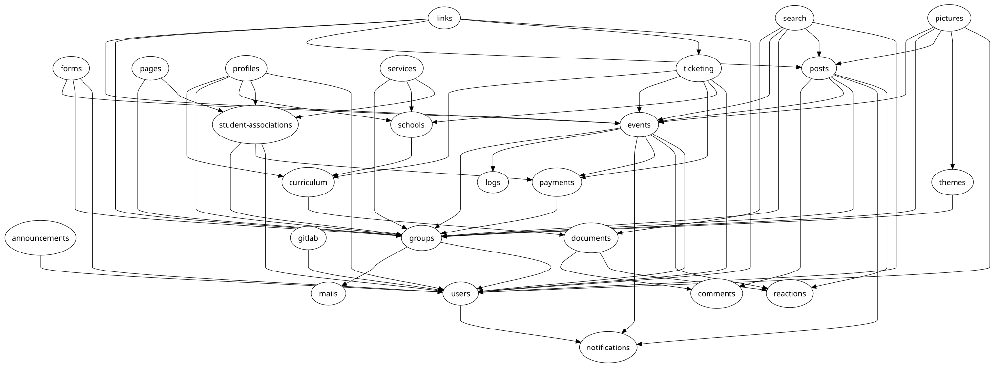

# Churros API

## Documentation website

See [api-docs.churros.inpt.fr](https://api-docs.churros.inpt.fr), or <http://localhost:5178> after running `yarn dev` in the repository's root.

## Architecture

- **build/**: the build output, generated by `yarn build`
- **prisma/**
  - **migrations/**: [the database migrations](https://www.prisma.io/docs/guides/database/developing-with-prisma-migrate); migrations allow incremental changes to the database schema
  - **schema.prisma**: the Prisma schema that describes the database structure
- **src/**
  - **lib/**: functions shared by most modules
  - **server/**: functions that define new routes and/or new endpoints
  - **modules/_name_**: modules that define the GraphQL schema. The name is in lower-dashed-case (called "kebab-case").
    - **types/**: GraphQL types (scalars, enums, input objects, objects, interfaces, unions, etc.)
      - **index.ts**: exports all the types (generated by running `yarn barrelize`)
      - _example-type.ts_: defines a type named `ExampleType`
    - **resolvers/**: GraphQL resolvers (queries, mutations, subscriptions, and fields)
      - **index.ts**: exports all the resolvers (generated by running `yarn barrelize`)
      - _query.example.ts_: defines a query named `example`
      - _mutation.example.ts_: defines a mutation named `example`
      - _subscription.example.ts_: defines a subscription named `example`
      - _example-type.example-field.ts_: defines a field named `exampleField` on the type `ExampleType` (which can be defined outside of this module, and imported with `#modules/module-name`)
    - **index.ts**: exports all the types and resolvers (generated by running `yarn barrelize`)
  - **index.ts**: starts the server
  - **schema.ts**: imports all the modules to build the schema (_don't forget to import your new module here!_)

### Importing types and code from other modules

Use `import { ... } from '#modules/module-name'` to import types and utility functions from another module named `module-name`.

- Never create circular dependencies between modules. You can check for dependencies by running `yarn modules-import-graph` in the api package. It'll warn you about any circular dependencies, and update the import graph shown below

- The `global` module can be imported by any module and never imports any module itself. It contains ubiquitous types such as the `DateTime` scalar.

#### Modules dependency graph

### Adding a new module

A module is a collection of one or more types (and their associated resolvers) that so closely related that their code can't be meaningfully separated into separate modules.

1. Define the necessary database table(s) (and enums) in `prisma/schema.prisma`
   1. Make sure that the line immediately after the model declaration (`model MyName {`) defines the id of the resource
   1. Use `@default(dbgenerated("nanoid('prefix:')"))` to set the ID's default value, where `prefix` is a short prefix corresponding to your resource's name as the id's default value
   1. Execute `node scripts/update-id-prefix-to-typename-map.js` to update the ID prefix to typename map in `src/lib/builder.ts`.
   1. Migrate the database by running `yarn migration a_descriptive_migration_name`
1. Define the GraphQL types and queries: You can use `yarn new-module` to build a new module in `src/modules/`.
1. TEST that your API works using the GraphiQL endpoint (`localhost:4000/graphql` in your browser), setting the `Authorization` header to various Bearer tokens that represent:
   - An admin user
   - Every possible case dependending on the permissions of the resource (for example, managers of an event for the `EventManager` resource)
   - A regular user
   - A logged-out user (i.e. no `Authorization` header)
